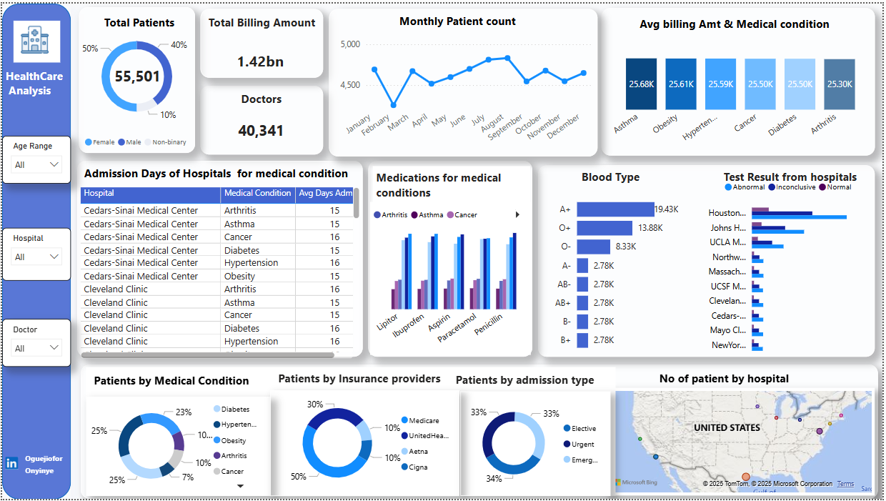

#  Healthcare Analysis Dashboard – Power BI Project

##  Project Overview

This analysis aims to support data-driven decision-making in healthcare by visualizing
trends in patient conditions, cost distribution, hospital admissions, and more.

## Dataset Info
- **Source**: Provided by CIEOS for the challenge
- **Total Records**: 55,501 unique patient entries 
- **Hospitals**: Data includes hospitals from multiple U.S. regions including Houston,
                Cleveland, and Los Angeles 
- **Key Fields**: Age, Gender, Blood Type, Diagnosed Conditions, Hospital Info, Insurance Provider, Admission Type, Treatment Cost,
                 Medications, Test Results, etc.
---

## Tools Used

- **Excel** – for data cleaning and transformation  
- **Power BI** – for dashboard creation and storytelling

---

## Analysis Objectives

1. Identify the most common demographics (age, gender, blood type)
2. Determine the most frequently diagnosed medical conditions
3. Analyze hospital admission types and lengths of stay
4. Examine treatment costs by condition, hospital, and insurance
5. Track medication usage trends across hospitals
6. Evaluate test results and patient outcomes
7. Highlight regional differences in healthcare performance

---

## Key Insights

- **Top Diagnosed Conditions**: Asthma, Obesity, Hypertension 
- **Avg Billing/Condition**: ₦25,000+
- **Dominant Blood Type**: A+
- **Gender Distribution**: Slightly more female patients
- **Most Admissions**: Cedars-Sinai and Cleveland Clinic (mostly planned)
- **Leading Insurance**: Medicare (covers 30% of patients)
- **Peak Admissions Month**: August
- **Red Flag**: Houston hospitals reported the highest abnormal test results,
                indicating possible quality concerns 
---

## Visualizations

- Bar and Column Charts (Cost per Condition, Blood type)
- Line chart(Monthly Admissions Trend)
- Stacked bar Chart (Test Results, and medications per condition)
- Map Visual (Regional hospital performance)
- Pie Charts (Gender, Insurance, Admission Types)
- KPI Cards (Total Patient, Doctors, Total billing)

---

## Limitations
- Limited temporal data for multi-year trend analysis
---

## Recommendations

- Investigate regional anomalies (e.g., Houston)  
- Improve test result standardization  
- Analyze insurance billing discrepancies  
- Include outcome tracking for long-term analysis

---

## Conclusion

This dashboard gives stakeholders actionable insight into healthcare delivery, 
helping optimize treatment strategies, improve care quality, 
and manage costs more effectively.

---

## Folders

- [`Dataset/`](./Dataset/) – Contains raw and cleaned Excel files  
- [`Visual/`](./Visual/) – Contains dashboard screenshots and the Power BI report

---

## Preview

---

## Connect
Let's connect! 👉 [Connect with me on LinkedIn](https://www.linkedin.com/in/onyinye-oguejiofor-e)

---

